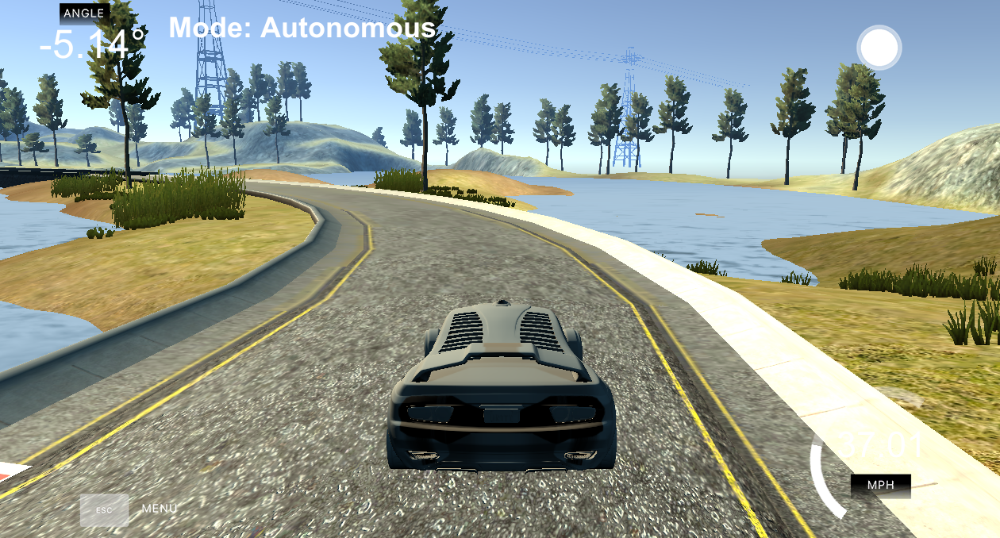
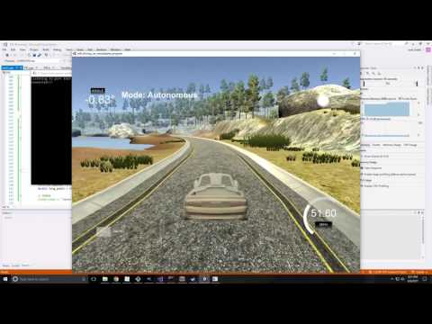

# CarND-Controls-PID

Self-Driving Car Engineer Nanodegree Program

PID control implementation for steering and throttle control using Twiddle for hyperparameter tuning.



---

## Dependencies

- cmake >= 3.5
- All OSes: click here for installation instructions
- make >= 4.1
  - Linux: make is installed by default on most Linux distros
  - Mac: install Xcode command line tools to get make
  - Windows: Click here for installation instructions
- gcc/g++ >= 5.4
  - Linux: gcc / g++ is installed by default on most Linux distros
  - Mac: same deal as make - [install Xcode command line tools]((https://developer.apple.com/xcode/features/)
  - Windows: recommend using MinGW
- uWebSockets == 0.13, but the master branch will probably work just fine
  - Follow the instructions in the uWebSockets README to get setup for your platform. You can download the zip of the appropriate version from the releases page. Here's a link to the v0.13 zip.
  - If you run OSX and have homebrew installed, you can just run the ./install-mac.sh script to install this
- Simulator. You can download these from the project intro page in the classroom.

## Basic Build Instructions

1. Clone this repo.
2. Make a build directory: `mkdir build && cd build`
3. Compile: `cmake .. && make`
4. Run it: `./pid`.

## Windows Install Instructions

1. Install, in your root c:/ directory, vcpkg https://github.com/Microsoft/vcpkg   (15 - 30 minutes)
2. Be sure while installing vcpkg to carefully follow all instructions! This is NOT an easy install process.
3. Install python 2.7 (dependency for libuv) 
4. cd to directory with vcpkg .exe and ./vcpkg install uWebsockets (20 min, mostly automatic)
5. Open CMakeSetting.json, check if C:/vcpkg/scripts/buildsystems/vcpkg.cmake is the correct directory to your vcpkg and DCMAKE_TOOLCHAIN_FILE matches the output from vcpkg integrate.
6. Open in VS17 community edition, build pid.exe in x86 debug.

## Rubric Points

The following section will cover the rubric points outlined for the project.

### Compilation

Project development was done in VS17 Community Edition.

### Implementation

The PID controller is implemented in two parts.  The PID controller and a system for automatic hyperparameter tuning called Twiddle.

#### PID

The code behind a PID controller is remarkably simple.  The controller is first initialized with PID::Init(Kp, Ki, Kd, lower_limit, upper_limit).  Where Kp is the proportional constant which controls how much of an impact any given error value impacts the control output, Ki is the integral constant which controls how much of an impact a sustained error value impacts the control output, and Kd is the derivative constant which controls how much the step-by-step change in error will impact the control output.

The lower_limit and upper_limit are used to constrain the controller's output values as well as stop the accumulation of integral error if the output is at a limit.  If the integral error was allowed to accumulate when the output is at a maximum the integral error can quickly become large and not allow the controller to recover from a large deviation.

After initialization the error is first updated by calling PID::UpdateError(error), line 25, this updates the p, i and d error terms.  
```c++
    d_error = p_error;
    p_error = error;
    
    // Only accumulate i error if output is not railed
    // This is to avoid windup
    if (output <= upper_limit && output >= lower_limit) {
        i_error += error;
    }
```

The control command can then be acquired by `PID::Command()`, line 44, which returns the control command by taking each of the p, i and d error terms and multiplying by their respective constants.
```c++
    output = -Kp*p_error - Ki*i_error - Kd*(p_error - d_error)
```

While the actual code behind the PID control is simple, the difficult part is selecting correct hyperparameters for the system.  Twiddle was used to automate this tuning process.

#### Twiddle

Twiddle is a systematic method of tuning hyperparameters.  Twiddle was implemented to tune the three PID parameters.  Each parameter goes through a tuning cycle where a slightly larger value is trialed, and the system error is evaluated.  If the error is better than the step size for next time is increased, and the next parameter is adjusted.  If the error does not improve the parameter is adjusted by the same amount in the opposite direction.  If this still does not provide an improved error, then the step size is reduced.  

To improve tuning a forced perturbance is added to the system in the form of a square wave.

Since the system was training while driving it was important to have reasonable initial tuning parameters such that the car would continue making laps around the test track.  After the step size for each parameter gets small enough Twiddle is turned off, and normal driving operation returns.

The Twiddle implementation can be found in `Twiddle.cpp` and `Twiddle.h`.  

### Reflection

Each tuning parameter has a specific impact on the system.  Kp adjusts how aggressively the steering reacts to a cross track error. Ki adjusts how much a sustained cross track error will bias the steering.  Kd can reduce oscillation in the system when tuned appropriately.  Oscillation can still occur when Kd is too small or too large for any given Kp.  Each term can induce oscillations which add to the challenge of tuning.

Before an automated tuning process could start a reasonably stable system had to be manually tuned.  Kp was gradually increased until oscillation around the target was achieved.  Kd was then increased until the oscillation was minimized.  With Kp and Kd set the car was able to drive continuously around the track at speeds around 30 MPH.  Twiddle was then used to further tune the system.  To help in the initial tuning, wander was turned on which added a forced square wave perturbance to the system.  Hyperparameters were updated after each round of Twiddle tuning.

### Simulation

Final solution provides safe driving results on the test track.

Click the picture below for the demo video on YouTube.
[](https://www.youtube.com/watch?v=5jfbjID_vB4)